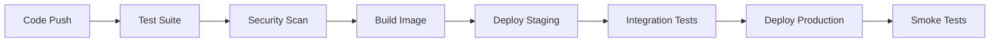

# 🚀 CQRS Production Deployment Guide

This guide provides comprehensive instructions for deploying the CQRS application in production environments using modern containerization and orchestration technologies.

## 📋 Table of Contents

- [Prerequisites](#prerequisites)
- [Quick Start](#quick-start)
- [Deployment Options](#deployment-options)
- [Configuration](#configuration)
- [Monitoring & Observability](#monitoring--observability)
- [Performance Optimization](#performance-optimization)
- [Security Considerations](#security-considerations)
- [Troubleshooting](#troubleshooting)
- [Best Practices](#best-practices)

## Prerequisites

### Required Tools

- **Docker** (v20.10+)
- **Kubernetes** (v1.25+)
- **kubectl** (matching your cluster version)
- **Go** (v1.24+)
- **Make** (for build automation)

### Optional Tools

- **Docker Compose** (for local multi-service setup)
- **Helm** (for advanced Kubernetes deployments)
- **Prometheus** & **Grafana** (for monitoring)

## Quick Start

### 1. Clone and Build

```bash
# Clone the repository
git clone <your-repo-url>
cd cqrs

# Initialize development environment
make init

# Run tests to ensure everything works
make test

# Build the application
make build
```

### 2. Local Development

```bash
# Start development server with hot reload
make dev

# Or run with Docker Compose
make compose-up
```

### 3. Production Deployment

```bash
# Build and deploy to production
make deploy-production

# Or deploy to staging first
make deploy-staging
```

## Deployment Options

### Option 1: Docker Compose (Recommended for Development)

**Pros:**
- Simple setup
- All services included
- Good for development and testing

**Cons:**
- Not suitable for production scale
- Limited high availability options

```bash
# Start all services
docker-compose up -d

# Check status
docker-compose ps

# View logs
docker-compose logs -f cqrs-app

# Stop services
docker-compose down
```

### Option 2: Kubernetes (Recommended for Production)

**Pros:**
- Production-ready
- Auto-scaling capabilities
- High availability
- Rolling updates
- Service discovery

**Cons:**
- More complex setup
- Requires Kubernetes knowledge

```bash
# Deploy to Kubernetes
kubectl apply -f k8s/

# Check deployment status
make k8s-status

# View logs
make k8s-logs
```

### Option 3: Automated Deployment Script

**Pros:**
- Simplified deployment process
- Built-in health checks
- Rollback capabilities

```bash
# Deploy with script
./scripts/deploy.sh build push deploy

# Check status
./scripts/deploy.sh status

# Rollback if needed
./scripts/deploy.sh rollback
```

## Configuration

### Environment Variables

| Variable | Default | Description |
|----------|---------|-------------|
| `ENV` | `production` | Environment (development/staging/production) |
| `PORT` | `8080` | Application port |
| `LOG_LEVEL` | `info` | Logging level |
| `METRICS_ENABLED` | `true` | Enable metrics collection |
| `REDIS_URL` | `redis:6379` | Redis connection URL |
| `DB_HOST` | `postgres` | Database host |
| `DB_PORT` | `5432` | Database port |
| `DB_NAME` | `cqrs_db` | Database name |
| `DB_USER` | `cqrs_user` | Database username |
| `DB_PASSWORD` | `cqrs_password` | Database password |

### Configuration Files

- **Development**: `configs/development.json`
- **Staging**: `configs/staging.json`
- **Production**: `configs/production.json`

### Secrets Management

For production deployments, use Kubernetes secrets:

```bash
# Create secret
kubectl create secret generic cqrs-secrets \
  --from-literal=DB_PASSWORD=your-secure-password \
  --from-literal=REDIS_PASSWORD=your-redis-password \
  -n cqrs-production
```

## Monitoring & Observability

### Metrics

The application exposes Prometheus metrics at `/metrics`:

- **Command/Query throughput**
- **Response times (P50, P95, P99)**
- **Error rates**
- **Resource utilization**
- **Business metrics**

### Health Checks

- **Health endpoint**: `/health` - Overall application health
- **Readiness endpoint**: `/ready` - Ready to serve traffic
- **Metrics endpoint**: `/metrics` - Prometheus metrics

### Monitoring Stack

The included monitoring stack provides:

1. **Prometheus** - Metrics collection
2. **Grafana** - Visualization and dashboards
3. **AlertManager** - Alert management

```bash
# Deploy monitoring stack
make monitoring

# Access Grafana
kubectl port-forward svc/grafana 3000:3000 -n monitoring

# Access Prometheus
kubectl port-forward svc/prometheus 9090:9090 -n monitoring
```

### Pre-configured Alerts

- High error rate (>10%)
- High latency (P95 >1s)
- Memory usage (>80%)
- CPU usage (>80%)
- Service down
- Database connection failures

## Performance Optimization

### Application-Level Optimizations

1. **Connection Pooling**
   - Database connection pools
   - Redis connection pools

2. **Caching Strategy**
   - Query result caching
   - Session caching
   - Application-level caching

3. **Concurrency Optimization**
   - Goroutine pools
   - Channel buffering
   - Lock-free data structures where possible

### Infrastructure Optimizations

1. **Horizontal Pod Autoscaling (HPA)**
   ```yaml
   # Configured to scale based on:
   # - CPU usage (70% threshold)
   # - Memory usage (80% threshold)
   # - Custom metrics (requests per second)
   ```

2. **Resource Requests and Limits**
   ```yaml
   resources:
     requests:
       memory: "128Mi"
       cpu: "100m"
     limits:
       memory: "512Mi"
       cpu: "500m"
   ```

3. **Persistent Volume Configuration**
   - Fast SSD storage for databases
   - Separate volumes for different workloads

### Performance Benchmarking

```bash
# Run comprehensive benchmarks
make benchmark-suite

# Run specific load tests
make load-test

# Profile application performance
make profile
```

## Security Considerations

### Container Security

1. **Non-root user**: Application runs as non-root user (UID 1001)
2. **Read-only filesystem**: Root filesystem is read-only
3. **Dropped capabilities**: All Linux capabilities dropped
4. **Security scanning**: Images scanned with Trivy

### Network Security

1. **TLS encryption**: All external communications encrypted
2. **Network policies**: Kubernetes network policies restrict traffic
3. **Service mesh**: Consider Istio for advanced security

### Secrets Management

1. **Kubernetes secrets**: Sensitive data stored as secrets
2. **Secret rotation**: Regular password rotation
3. **External secret management**: Consider HashiCorp Vault

### RBAC Configuration

```yaml
# Service account with minimal privileges
apiVersion: v1
kind: ServiceAccount
metadata:
  name: cqrs-app
  namespace: cqrs-production
```

## Troubleshooting

### Common Issues

#### 1. Application Won't Start

**Symptoms**: Pod in CrashLoopBackOff state

**Solutions**:
```bash
# Check logs
kubectl logs deployment/cqrs-app -n cqrs-production

# Check events
kubectl describe pod <pod-name> -n cqrs-production

# Verify configuration
kubectl get configmap cqrs-config -n cqrs-production -o yaml
```

#### 2. High Memory Usage

**Symptoms**: Pods being OOMKilled

**Solutions**:
```bash
# Check memory usage
kubectl top pods -n cqrs-production

# Increase memory limits
kubectl patch deployment cqrs-app -n cqrs-production -p '{"spec":{"template":{"spec":{"containers":[{"name":"cqrs-app","resources":{"limits":{"memory":"1Gi"}}}]}}}}'

# Analyze memory profile
make profile
```

#### 3. Database Connection Issues

**Symptoms**: Database connection errors in logs

**Solutions**:
```bash
# Check database pod status
kubectl get pods -n cqrs-production -l app=postgres

# Test database connectivity
kubectl run -it --rm debug --image=postgres:16-alpine --restart=Never -- psql -h postgres-service -U cqrs_user -d cqrs_db

# Check database logs
kubectl logs deployment/postgres -n cqrs-production
```

### Debug Commands

```bash
# Enter running container
kubectl exec -it deployment/cqrs-app -n cqrs-production -- /bin/sh

# Port forward for local debugging
kubectl port-forward deployment/cqrs-app 8080:8080 -n cqrs-production

# Create debug pod
kubectl run debug --image=cqrs-app:latest -it --rm --restart=Never -- /bin/sh
```

## Best Practices

### Development

1. **Test Coverage**: Maintain >90% test coverage
2. **Code Quality**: Use linters and static analysis
3. **Documentation**: Keep documentation up-to-date
4. **Dependency Management**: Regular dependency updates

### Deployment

1. **Blue-Green Deployments**: Use for zero-downtime deployments
2. **Rolling Updates**: Default strategy for regular updates
3. **Canary Releases**: For high-risk changes
4. **Automated Rollbacks**: Configure automatic rollback triggers

### Operations

1. **Monitoring**: Comprehensive monitoring and alerting
2. **Logging**: Structured logging with correlation IDs
3. **Backup Strategy**: Regular backups of persistent data
4. **Disaster Recovery**: Documented recovery procedures

### Security

1. **Regular Updates**: Keep base images and dependencies updated
2. **Vulnerability Scanning**: Automated security scanning
3. **Access Control**: Principle of least privilege
4. **Audit Logging**: Log all administrative actions

## CI/CD Pipeline

The included GitHub Actions workflow provides:

1. **Continuous Integration**
   - Automated testing
   - Code quality checks
   - Security scanning
   - Build verification

2. **Continuous Deployment**
   - Automated deployments to staging
   - Manual approval for production
   - Rollback capabilities
   - Post-deployment verification

### Pipeline Stages



## Scaling Considerations

### Horizontal Scaling

- **Application pods**: Scale based on CPU/memory/custom metrics
- **Database**: Consider read replicas for read-heavy workloads
- **Cache**: Redis clustering for high availability

### Vertical Scaling

- **Resource limits**: Monitor and adjust as needed
- **Storage**: Expandable persistent volumes
- **Network**: Consider dedicated networking for high throughput

## Support & Maintenance

### Regular Tasks

1. **Security updates** (Weekly)
2. **Dependency updates** (Monthly)
3. **Performance reviews** (Monthly)
4. **Capacity planning** (Quarterly)

### Monitoring Checklist

- [ ] Application health checks passing
- [ ] Error rates within acceptable limits
- [ ] Response times meeting SLA
- [ ] Resource utilization optimized
- [ ] Database performance stable
- [ ] Cache hit rates acceptable
- [ ] Backup processes working

## Additional Resources

- [API Reference](API_REFERENCE.md)
- [Usage Guide](USAGE_GUIDE.md)
- [Architecture Documentation](../README.md)
- [Contributing Guidelines](../CONTRIBUTING.md)

---

For questions or issues, please refer to the troubleshooting section or create an issue in the repository.
